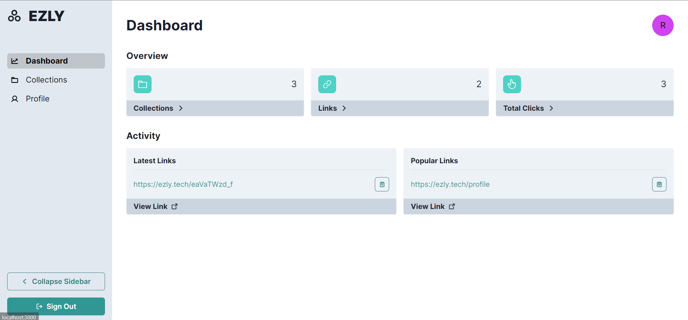
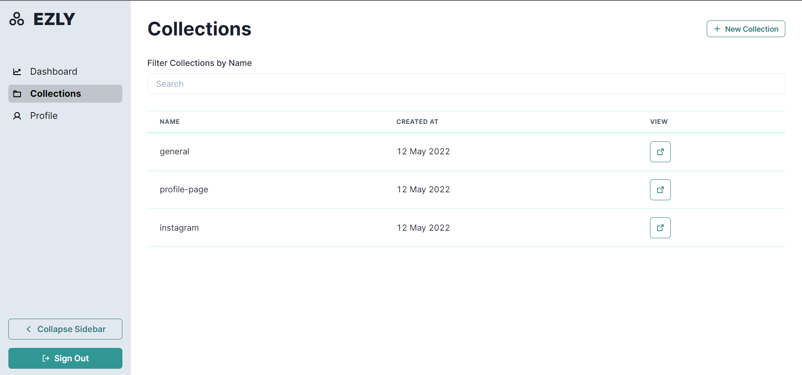
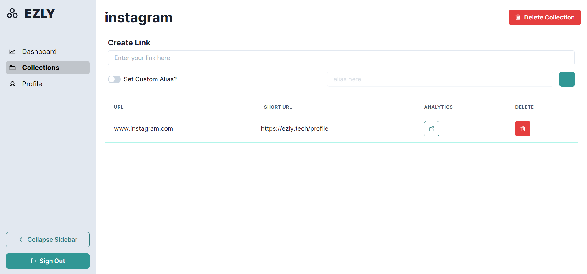
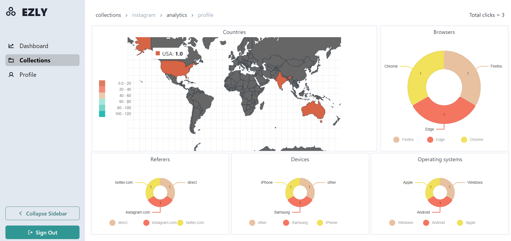
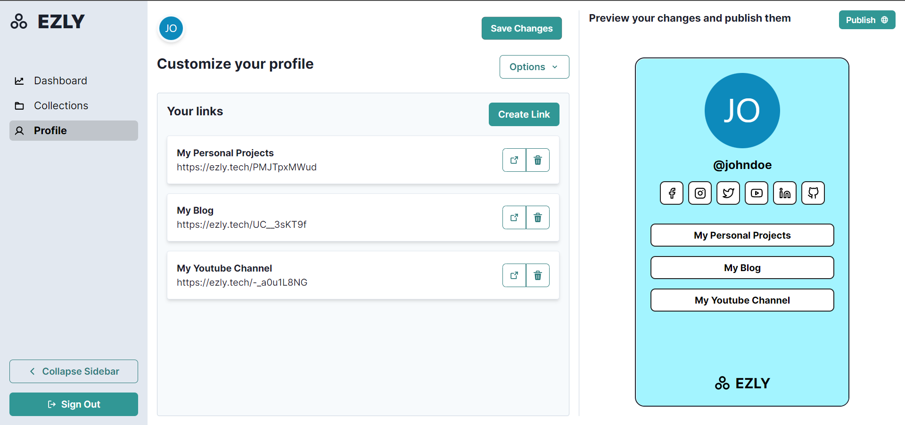

# Ezly Server

Ezly is a web tool that helps professionals, startup companies, and businesses create a presence on the internet. Ezly aggregates links to social media accounts, all on one page. You can customize the look and feel by adding pictures and using various templates from Ezly's creators' section.

Ezly offers URL shortening, sharing, and custom digital portfolios to create
a digital presence.

Ezly supports various features such as search engine optimization with social media integration, tracking of traffic statistics, and management of multiple URL tags.

# Features

- URL Shortening
- Analytics
- Link Management using Collections
- Custom Website Builder
- SEO Friendly Profile Pages

# Requirements

- node v16 or above
- yarn
- docker
- docker-compose

# Installation Notes

Setup an `.env.development` file with the correct parameters. Use `sample.env` as a guideline.

```
docker-compose up -d
yarn
```

# Run Instructions

```
yarn dev
```

Commands for specific instructions ( seeding, resetting database etc) can be found in the `package.json` file.

# Screenshots











# Team Members

- [Siddharth Borderwala](https://github.com/siddharthborderwala)
- [Aman Yadav](https://github.com/yadav-aman)
- [Shagun Agrawal](https://github.com/standmarsh)
